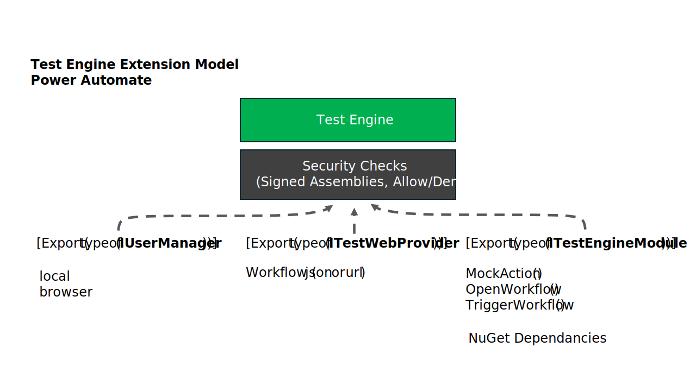

# Overview

The Power Apps Test Engine provider for Power Automate enables you to perform unit testing of Power Automate Cloud flow workflows.

## Architecture

## User Authentication

### Local Loop Testing

The local authentication use useful the definition of the cloud flow is locally available on the local computer. In this use case no authentication is required for unit tests.

### Integration Testing

To run a integration test user authentication may be needed to trigger test of the cloud flow from the Power Automate portal

## Power Automate Provider

Create a new provider that makes use of knowledge of the structure of the work flow to create Power Fx representation of a Workflow. This enables Power FX variables to be created that can query and update of  to manage the test state.

## Power Automate Extensions

### Open Workflow

The `OpenWorkflow()` function can be used to load workflow from url or a local file

### Mock Action

The `MockAction()` function can be used to mock the outcomes and data for a workflow action

## Trigger Workflow

The `TriggerWorkflow()` function allows the cloud flow to be triggered with optional data
